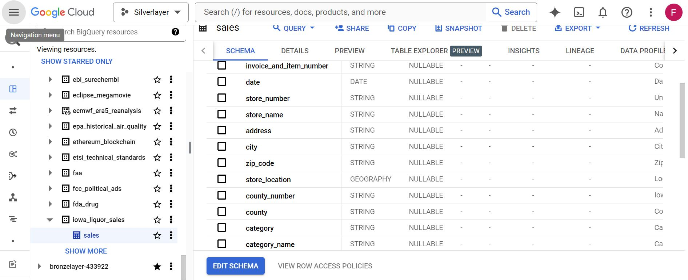
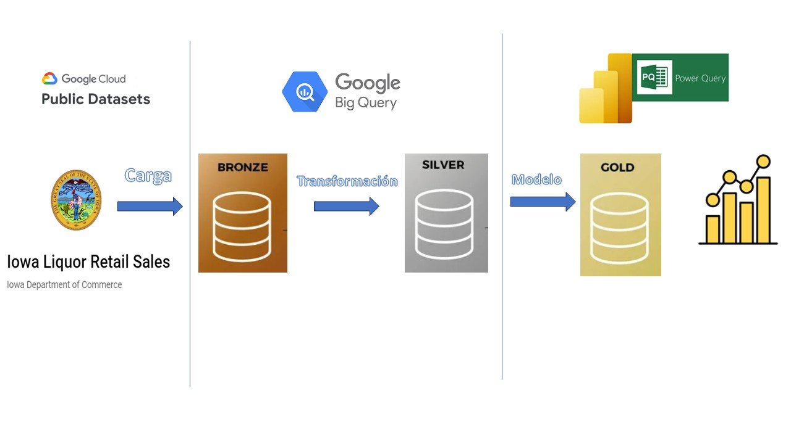
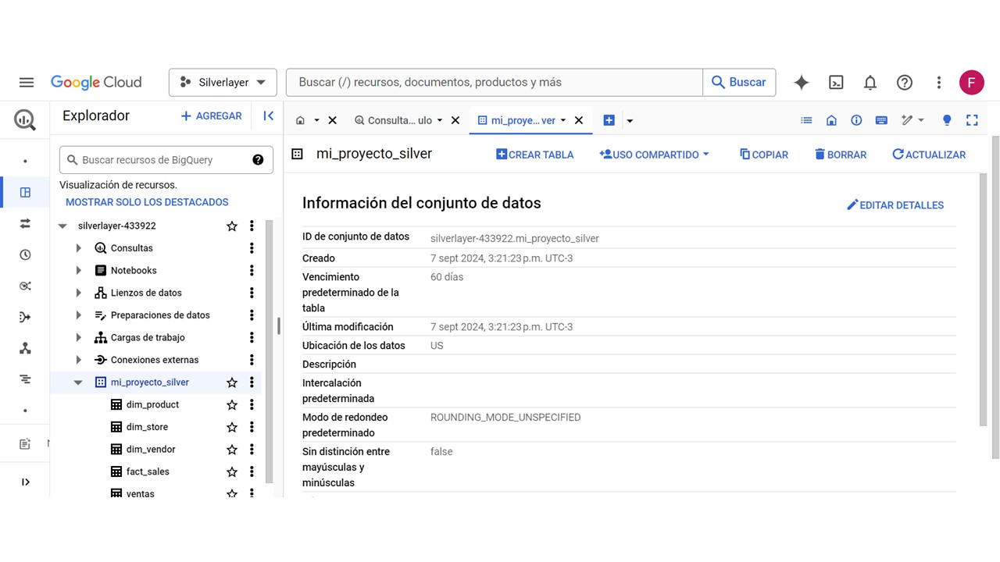
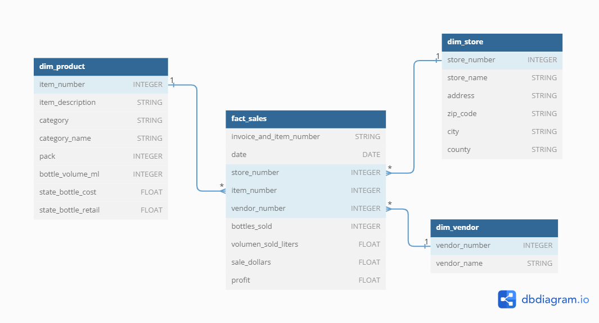
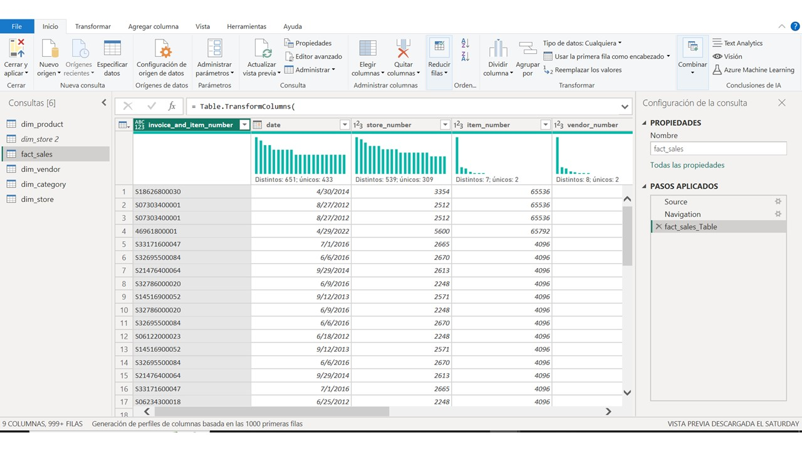
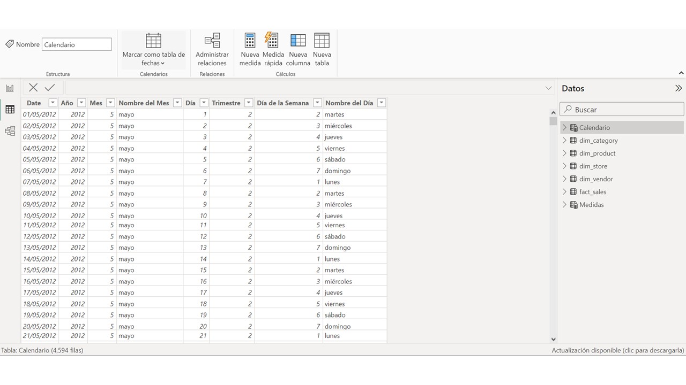
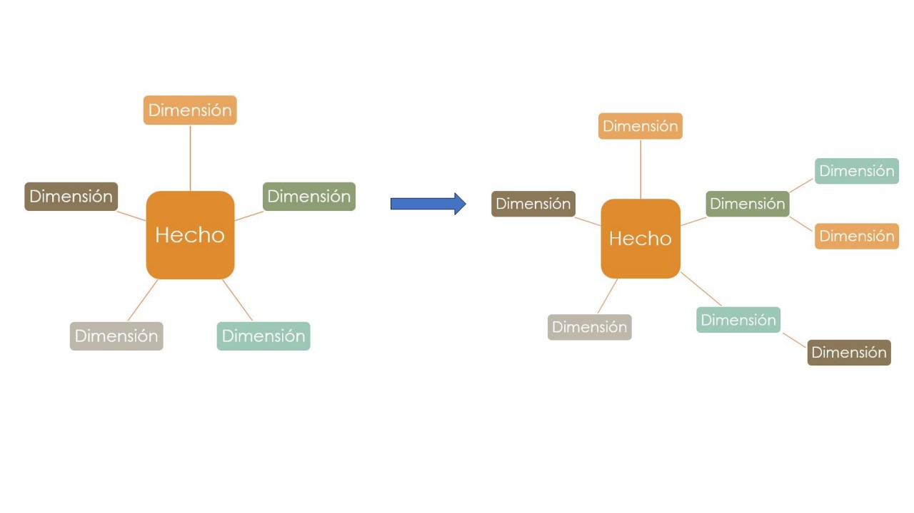
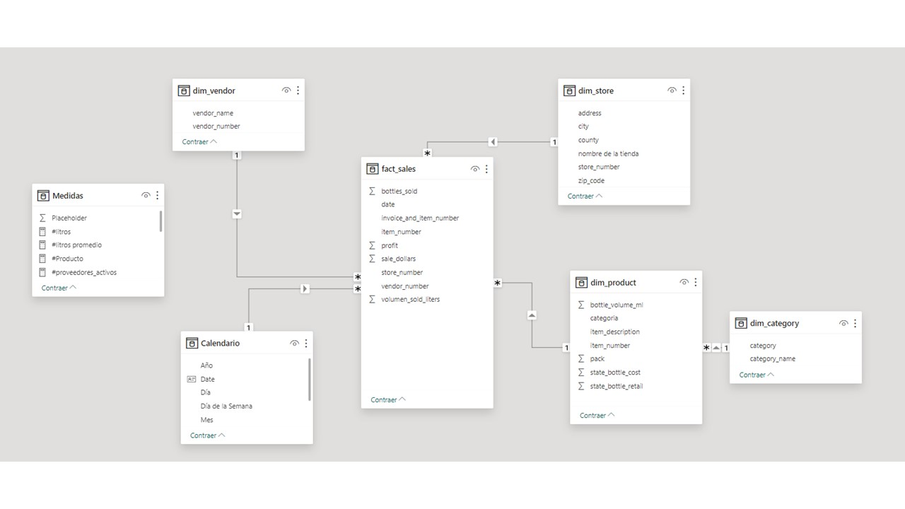
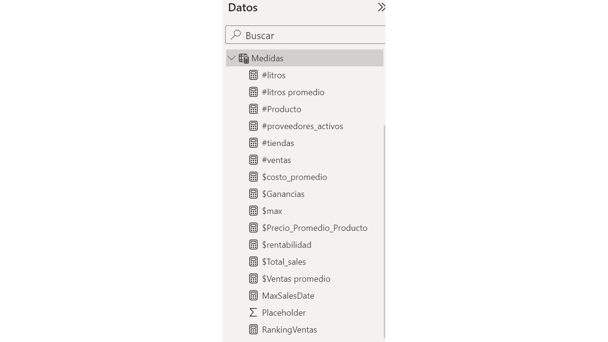

`Proyecto final EDVAI- análisis de ventas de licorerías en IOWA

# Ventas de Iowa - Análisis de Datos

# Índice del Proyecto Final

- [Presentación de la Temática](#presentacion-de-la-tematica)
- [Orígenes de la Información](#origenes-de-la-informacion)
- [Foco de Análisis](#foco-de-analisis)
- [Descripción de la Base de Datos](#descripcion-de-la-base-de-datos)
- [Modelo de Entidades y Relaciones - Origen Bronze/Raw](#modelo-de-entidades-y-relaciones---origen-bronzeraw)
- [Plan de Métricas](#plan-de-metricas)
- [Proceso ETL](#proceso-etl)
- [Modelo DER para Power BI](#modelo-der-para-power-bi)
- [Principales Medidas en DAX](#principales-medidas-en-dax)
- [Conclusiones o cumplimiento de hipótesis](#conclusiones-o-cumplimiento-de-hipotesis)
- [Links](#links)


## 1. Presentación de la Temática
La base de datos de "Ventas de Iowa" documenta transacciones comerciales en diversas categorías de productos en Iowa, Estados Unidos. El objetivo es proporcionar información sobre ventas, permitiendo análisis de patrones de consumo, rendimiento de productos y comportamiento de ventas por ubicación y temporalidad.

## 2. Orígenes de la Información
Los datos son públicos y se encuentran en BigQuery, recopilando información de:
- Registros transaccionales de puntos de venta en Iowa.
- Inventario de tiendas en Iowa.
- Información demográfica y geolocalización.




## 3. Plan de Métricas
El [plan de metricas](https://github.com/MFSklateBoja/Edvai_Data_analysis/blob/gh-pages/Plan%20de%20m%C3%A9tricas.xlsx) incluye:
- **Análisis de ventas**: total de ventas, variación temporal, precios promedio, costos, ganancia y rentabilidad.
- **Indicadores geográficos**: ventas por región.
- **Análisis de productos**: rotación de productos y margen de ganancia.

## 4. Foco de Análisis
Los principales enfoques de análisis incluyen:
- **Tendencias de consumo**: Categorías más vendidas y comportamiento de consumidores.
- **Rendimiento de ventas por región**: Identificación de zonas con mayor actividad comercial.
- **Estacionalidad y ventas**: Fluctuaciones de ventas en función de temporadas y eventos.
- **Optimización de inventario**: Identificación de productos de alta y baja rotación.

### Hipótesis
1. Las ventas aumentan durante eventos festivos.
2. Las campañas de marketing aumentan ventas en días específicos.
3. Las ventas son más bajas los fines de semana.
4. Existen proveedores clave en el mercado.
5. La demanda varía significativamente según la región.
6. Los productos de menor precio tienen mayor rotación.
7. Las botellas se venden en packs de 6 o 12.

## 5. Descripción de la Base de Datos - Origen Bronze/Raw
La capa raw incluye solo una tabla con las ventas en crudo para análisis geográfico y de inventario.
La base de datos registra transacciones de bebidas alcohólicas. Los campos principales son:

| Campo              | Descripción                                                    |
|--------------------|----------------------------------------------------------------|
| Invoice/Item Number | Número de factura/ítem en la transacción                      |
| Date               | Fecha de la transacción                                        |
| Store Number       | Identificación única del minorista                             |
| Store Name         | Nombre del establecimiento                                     |
| Address            | Dirección de la tienda                                         |
| City               | Ciudad de la tienda                                            |
| Zip Code           | Código postal de la tienda                                     |
| Store Location     | Coordenadas geográficas de la tienda                           |
| County Number      | Número del condado                                             |
| County             | Nombre del condado                                             |
| Category           | Clasificación del licor                                        |
| Vendor Number      | Número del proveedor                                           |
| Vendor Name        | Nombre del proveedor                                           |
| Item Number        | Código del producto vendido                                    |
| Item Description   | Descripción del producto                                       |
| Pack               | Unidades por paquete                                           |
| Bottle Volume (ml) | Volumen de la botella en ml                                    |
| State Bottle Cost  | Costo de la botella para el estado                             |
| State Bottle Retail| Precio de venta al público                                     |
| Bottles Sold       | Número de botellas vendidas                                    |
| Sale (Dollars)     | Monto total de la venta en dólares                             |
| Volume Sold (Liters)| Volumen total vendido en litros                                |
 


## 6. Transformación y carga de datos:
El proyecto se estructura bajo una arquitectura Medallion (capas Bronze, Silver y Gold), como se represente en el sgte esquema.



## 7. Proceso ETL - capa silver
En la capa Silver se organizó la información en diferentes tablas, para lo cual se generaron sentencias DDL.
- **Extracción**: Datos crudos desde sistemas de transacciones.
- **Transformación**:
  - Limpieza de datos.
  - Eliminación de datos nulos.
  - Creación de tablas con datos unicos.
  - Unificación de tipos de datos por columna.
  - Agregación de columnas calculadas.
- **Carga**: Datos transformados a BigQuery en capa silver.

### `queries.sql` (para las consultas SQL)

```sql
-- Crear tabla ventas en la capa Silver
CREATE OR REPLACE TABLE `mi_proyecto_silver.ventas` AS 
SELECT * FROM `bronzelayer-433922.mi_proyecto_bronce.ventas`
WHERE invoice_and_item_number IS NOT NULL
  AND date IS NOT NULL
  AND store_number IS NOT NULL
  AND item_number IS NOT NULL
  AND vendor_number IS NOT NULL
  AND category IS NOT NULL;

-- Crear tabla de hechos (fact_sales)
CREATE OR REPLACE TABLE `mi_proyecto_silver.fact_sales` AS 
SELECT invoice_and_item_number, date, store_number, item_number, vendor_number, bottles_sold
FROM `bronzelayer-433922.mi_proyecto_bronce.ventas`;

-- Crear tabla de proveedores (dim_vendor)
CREATE OR REPLACE TABLE `mi_proyecto_silver.dim_vendor` AS 
SELECT SAFE_CAST(vendor_number AS INT64) AS vendor_number, vendor_name
FROM (
  SELECT DISTINCT vendor_number, vendor_name
  FROM `mi_proyecto_silver.ventas`
  WHERE SAFE_CAST(vendor_number AS FLOAT64) IS NOT NULL
);

-- Crear tabla de productos (dim_product)
CREATE OR REPLACE TABLE `mi_proyecto_silver.dim_product` AS 
SELECT SAFE_CAST(item_number AS INT64) AS item_number, item_description, category, pack, bottle_volume_ml, state_bottle_cost, state_bottle_retail
FROM (
  SELECT DISTINCT item_number, item_description, category, pack, bottle_volume_ml, state_bottle_cost, state_bottle_retail
  FROM `mi_proyecto_silver.ventas`
  WHERE SAFE_CAST(item_number AS FLOAT64) IS NOT NULL
);

-- Crear tabla de tiendas (dim_store)
CREATE OR REPLACE TABLE `mi_proyecto_silver.dim_store` AS 
SELECT CAST(CAST(store_number AS FLOAT64) AS INT64) AS store_number, store_name, address, city, zip_code, county, store_location
FROM (
  SELECT DISTINCT store_number, store_name, address, city, zip_code, county, store_location
  FROM `mi_proyecto_silver.ventas`
);
```




El modelo DER preliminar de la capa silver es el siguiente:


### 8. Modelado para Power BI
#### Power Query

Se llevó a cabo otro proceso de transformación y carga de datos utilizando Power Query, realizando una serie de ajustes y mejoras en los datos para su uso en Power BI.



El proceso incluyó los siguientes pasos:

- **Renombrar columnas**: Se asignaron nombres más descriptivos a algunas columnas para mejorar la claridad y comprensión de los datos.
- **Corrección de tipos de datos**: Se ajustaron los tipos de datos para asegurar que cada columna tuviera el formato adecuado (números, fechas, textos, etc.).
- **Generación de columnas clave**: Se crearon columnas con claves numéricas para facilitar la identificación y relación entre diferentes tablas.
- **Eliminación de duplicados**: Se eliminaron registros duplicados para garantizar la integridad y calidad de los datos.
- **Tratamiento de datos nulos**: Se implementaron dos estrategias distintas para manejar los valores faltantes:
  - En el caso de los **nombres de categorías**, se creó una dimensión adicional que contenía los nombres correspondientes a cada categoría.
  - Para los **nombres de tiendas**, se revisó la tabla `fact_sales` y se identificó un nombre de tienda que no aparecía en la dimensión existente. Para solucionar esto, se generó nuevamente la dimensión `store` utilizando un *join* entre ambas tablas.
   - **Creación de la tabla calendario**, se creó la dimension calendario a través de la DAX correspondiente. Esta tabla permite realizar análisis detallados basados en fechas dentro del modelo de Power BI.
       ```DAX
       Calendario = 
          ADDCOLUMNS (
              CALENDAR (MIN(fact_sales[date]), MAX(fact_sales[date])),  // Basada en la columna de fechas de Orders
              "Año", YEAR([Date]),
              "Mes", MONTH([Date]),
              "Nombre del Mes", FORMAT([Date], "MMMM", "es-ES"),  // Formato en español
              "Día", DAY([Date]),
              "Trimestre", QUARTER([Date]),
              "Día de la Semana", WEEKDAY([Date], 2),  // Lunes como primer día
              "Nombre del Día", FORMAT([Date], "dddd", "es-ES")  // Formato en español
          )
       ```
       


Este proceso de transformación permitió preparar los datos de manera adecuada para su modelado y posterior análisis en Power BI.
 
Esquema estrella/copo de nieve en Power BI:
- **Fact Table**: `facts_sales` - Datos de ventas.
- **Dimensión**: `dim_product`, `dim_store`, `dim_vendor`, `dim_category`, `calendario`.

Cabe aclarar que al agregar la dimensión categoría se paso de un esquema de estrella a uno tipo copo de nieve.

Resultando de esta manera el DER que constituye la capa Gold del modelo:


## 9. Principales Medidas en DAX
Las medidas usadas en Power BI se agruparon en la tabla de medidas. En ellas sse encuentran todas las medidas planteadas en el plan de métricas.



### 1. **Ventas Totales (`#ventas`)**
```DAX
#ventas = COUNT(fact_sales[invoice_and_item_number])
```
**Descripción**: Cuenta el número de ventas totales, considerando cada venta como una entrada única en la columna `invoice_and_item_number`.

---

### 2. **Total de Ventas en Dólares (`$Total_sales`)**
```DAX
$Total_sales = SUM(fact_sales[sale_dollars])
```
**Descripción**: Suma el total de las ventas en dólares de la columna `sale_dollars` en la tabla `fact_sales`.

---

### 3. **Número de Tiendas (`#tiendas`)**
```DAX
#tiendas = COUNT(dim_store[store_number])
```
**Descripción**: Cuenta cuántas tiendas únicas (`store_number`) están registradas en la tabla `dim_store`.

---

### 4. **Proveedores Activos (`#proveedores_activos`)**
```DAX
#proveedores_activos = DISTINCTCOUNT(fact_sales[vendor_number])
```
**Descripción**: Cuenta la cantidad de proveedores distintos que han realizado ventas, utilizando la columna `vendor_number` de la tabla `fact_sales`.

---

### 5. **Litros Vendidos (`#litros`)**
```DAX
#litros = SUM(fact_sales[volumen_sold_liters])
```
**Descripción**: Suma el total de litros vendidos, según la columna `volumen_sold_liters` de la tabla `fact_sales`.

---

### 6. **Precio Promedio por Producto (`$Precio_Promedio_Producto`)**
```DAX
$Precio_Promedio_Producto = AVERAGE(fact_sales[sale_dollars])
```
**Descripción**: Calcula el precio promedio de los productos vendidos, utilizando los datos de la columna `sale_dollars`.

---

### 7. **Ranking de Ventas (`RankingVentas`)**
```DAX
RankingVentas = RANKX(ALLSELECTED(fact_sales), [$Total_sales],, DESC)
```
**Descripción**: Crea un ranking de las ventas totales en función del valor de `Total_sales`. Ordena de mayor a menor (`DESC`).

---

### 8. **Ganancias Totales (`$Ganancias`)**
```DAX
$Ganancias = SUM(fact_sales[profit])
```
**Descripción**: Suma las ganancias totales de las ventas, utilizando la columna `profit`.

---

### 9. **Rentabilidad (`$rentabilidad`)**
```DAX
$rentabilidad = [$Ganancias] / [$Total_sales]
```
**Descripción**: Calcula el margen de rentabilidad, dividiendo las ganancias totales (`$Ganancias`) entre las ventas totales (`$Total_sales`).

---

### 10. **Ventas Promedio (`$Ventas_promedio`)**
```DAX
$Ventas_promedio = AVERAGE(fact_sales[sale_dollars])
```
**Descripción**: Calcula la venta promedio por transacción, tomando el promedio de la columna `sale_dollars`.

---

### 11. **Venta Máxima (`$max`)**
```DAX
$max = MAX(fact_sales[sale_dollars])
```
**Descripción**: Encuentra la venta más alta registrada en la columna `sale_dollars`.

---

### 12. **Fecha de Mayor Venta (`MaxSalesDate`)**
```DAX
MaxSalesDate = VAR MaxSales = CALCULATE(MAX(fact_sales[sale_dollars]))
RETURN CALCULATE(MAX(fact_sales[date]), fact_sales[sale_dollars] = MaxSales)
```
**Descripción**: Encuentra la fecha de la venta más alta, primero identificando la venta máxima y luego devolviendo la fecha correspondiente a esa venta en la columna `date`.

## 10.	Conclusiones o cumplimiento de hipótesis
-	Aumento de ventas en eventos festivos y campañas de marketing: Se observa un incremento significativo en las ventas durante los meses de julio y diciembre. Sin embargo, la fecha de ventas máxima se encuentra fuera de estos periodos, pudiendo corresponderse al efecto de una campaña de marketing.
-	Tendencias semanales de ventas: A lo largo de la semana, las ventas siguen un patrón claro: los días miércoles y jueves son los más fuertes, probablemente como resultado de campañas promocionales. En contraste, las ventas caen drásticamente durante los fines de semana, posiblemente debido a que muchas tiendas permanecen cerradas.

-	Variación de ventas en los últimos años: Aunque la rentabilidad se ha mantenido, las ventas han disminuido considerablemente en los últimos cuatro años. Históricamente, los meses de diciembre y junio mostraban un aumento significativo en las ventas, pero esta tendencia cambió a partir de 2018, con un mayor consumo al inicio del año. A pesar de estas variaciones, los días de mayor venta no han cambiado.


-	Variaciones regionales en la demanda: La demanda de productos varía considerablemente según la región de Iowa. El condado de Polk ha mantenido consistentemente el mayor volumen de ventas, lo cual se corresponde con la mayor concentración de tiendas en esa área.


-	Proveedores clave en el mercado: Un grupo reducido de proveedores es responsable de la mayoría de las ventas, destacándose como líderes en el rubro.


-	Rotación de productos por categoría: Los productos de menor precio tienden a tener una rotación más alta, lo que significa que las categorías más vendidas no coinciden necesariamente con los artículos más costosos.
-	Presentación de productos: En su mayoría, los productos se venden en packs de 6 o 12 botellas, con tamaños que generalmente no superan el litro.


- Para realizar un análisis en mayor profundidad de los datos será necesario un tratamiento exhaustivo de los datos faltantes. En el caso de las tiendas sin condado se les asignaron el termino "sin asignar", resultando una gran cantidad de tiendas bajo esta region. Este inconveniente puede ser resuelto a través la localización de las tiendas buscandolas por su nombre. En el caso de los productos, existe una gran cantidad que no tienen categoría asignada. Por lo cual, es necesario generar un mayor número de categorias que abarquen estos productos.


## Links
[Link al reporte](https://app.powerbi.com/view?r=eyJrIjoiNDZmYmI1NDYtNjQ4MC00ZDA0LWFiOWEtZGY4NzBiMzBmNGNkIiwidCI6ImJjMjA1YTI0LTAxOWUtNDE5OC05MmFjLWVhYWRhODVmZTFiMiIsImMiOjR9)

[Link al plan de métricas](./Plan%20de%20m%C3%A9tricas.xlsx)

[Link al archivo sql](./queries.sql)

---

